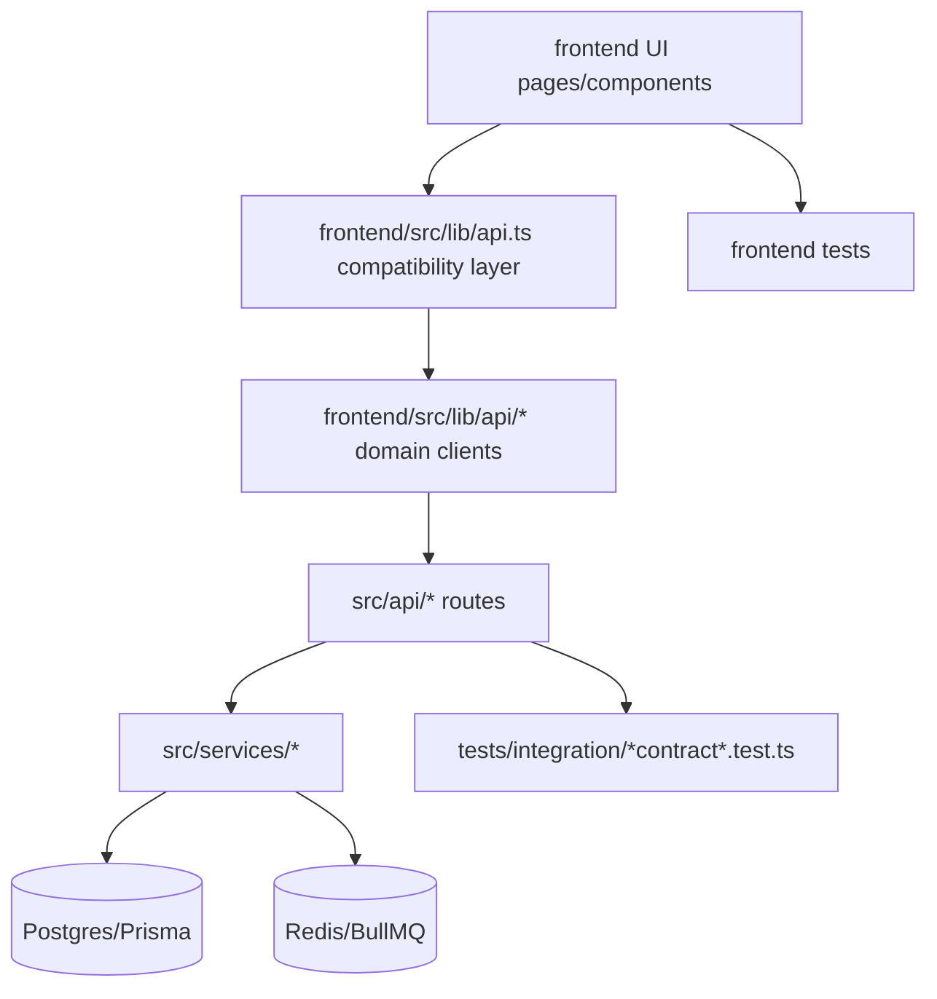

# AI Development Guide

This guide is the fast path for making safe changes in this codebase during roadmap work.

## Core principles

- Keep external API contracts stable until roadmap task `T57`.
- Prefer additive changes over route/path rewrites during refactors.
- Use compatibility shims when splitting modules.
- Validate every roadmap task with the standard baseline:
  - `npm run lint`
  - `npm run build`
  - `npm run test`
  - `npm --prefix frontend run test -- --run`
  - `npm run test:security`
  - `npm run test:reliability`
  - `npm run db:migrate:smoke` (required for migration-affecting tasks; CI blocking)

## Module map

### Backend

- `src/app.ts`: route wiring and middleware composition.
- `src/api/dashboard-routes.ts`: compatibility shim that mounts dashboard sub-modules from `src/api/dashboard/`.
- `src/api/dashboard/`: dashboard domains (`access`, `permissions`, `billing`, `ops`, `security`, `data-quality`, etc.).
- `src/api/setup-routes.ts`: setup endpoints.
- `src/api/ai-settings-routes.ts`: AI settings and provider config endpoints.
- `src/services/`: domain services (AI config, transcript processing, queue/reliability, story building).
- `src/middleware/`: auth, permissions, audit, rate limiting, PII masking.

### Frontend

- `frontend/src/App.tsx`: top-level composition only.
- `frontend/src/app/`: app shell, route tree, nav config, global modal mounts.
- `frontend/src/lib/api.ts`: compatibility export layer for API client functions and shared types.
- `frontend/src/lib/api/`: domain client modules (`http`, `auth`, `stories`, `setup`, `platform`, plus pending splits).
- `frontend/src/components/StoryGeneratorModal.tsx`: story generation UI composition.
- `frontend/src/components/story-generator/`: extracted story generation hooks.
- `frontend/src/styles/`: CSS architecture (`themes`, `reset`, `utilities`, `features`).

## Ownership map (working convention)

- API contracts and route behavior: backend API layer (`src/api/**`).
- Business logic and AI/provider policy: service layer (`src/services/**`).
- Auth/session and impersonation behavior: middleware + `frontend/src/lib/api/auth.ts`.
- Story generation UX and orchestration: `frontend/src/components/StoryGeneratorModal.tsx` and `frontend/src/components/story-generator/**`.
- Shared UI styling primitives and global CSS rules: `frontend/src/styles/**`.

## Where to change X

| Change needed | Primary file(s) |
| --- | --- |
| Add or modify dashboard endpoint behavior | `src/api/dashboard/*` and dashboard integration tests under `tests/integration/dashboard-*-contract.integration.test.ts` |
| Adjust setup wizard API behavior | `src/api/setup-routes.ts` and setup-related tests |
| Change story generation request/response client contract | `frontend/src/lib/api/stories.ts` (exported through `frontend/src/lib/api.ts`) |
| Update auth/session handling in client | `frontend/src/lib/api/http.ts` and `frontend/src/lib/api/auth.ts` |
| Update app navigation/routes | `frontend/src/app/nav-config.tsx` and `frontend/src/app/routes.tsx` |
| Change Story Generator behavior | `frontend/src/components/story-generator/*.ts` and `frontend/src/components/StoryGeneratorModal.tsx` |
| Modify CSS tokens/reset/utilities | `frontend/src/styles/themes.css`, `frontend/src/styles/reset.css`, `frontend/src/styles/utilities.css` |
| Add feature-level styles | `frontend/src/styles/features.css` |

## Test matrix

| Scope | Commands |
| --- | --- |
| Full backend+integration | `npm run test` |
| Frontend unit/a11y | `npm --prefix frontend run test -- --run` |
| Security regression | `npm run test:security` |
| Reliability regression | `npm run test:reliability` |
| Migration smoke (clean/seeded/upgrade) | `npm run db:migrate:smoke` |
| Ingest payload parity contract | `npm run test:contracts` |
| Lint + type/build safety | `npm run lint && npm run build && npm --prefix frontend run build` |
| Contract freeze checks | `npm run contracts:check` |
| File size guardrails (warn-only) | `npm run contracts:file-size:warn` |

## Route/client dependency graph

## Refactor checklist for AI agents

1. Identify the owning module from the map above.
2. Keep public route paths and response envelopes unchanged.
3. Add/adjust tests at module boundary and contract boundary.
4. Run validation baseline before proposing merge.
5. Document migration risk and rollback notes when behavior changes.
